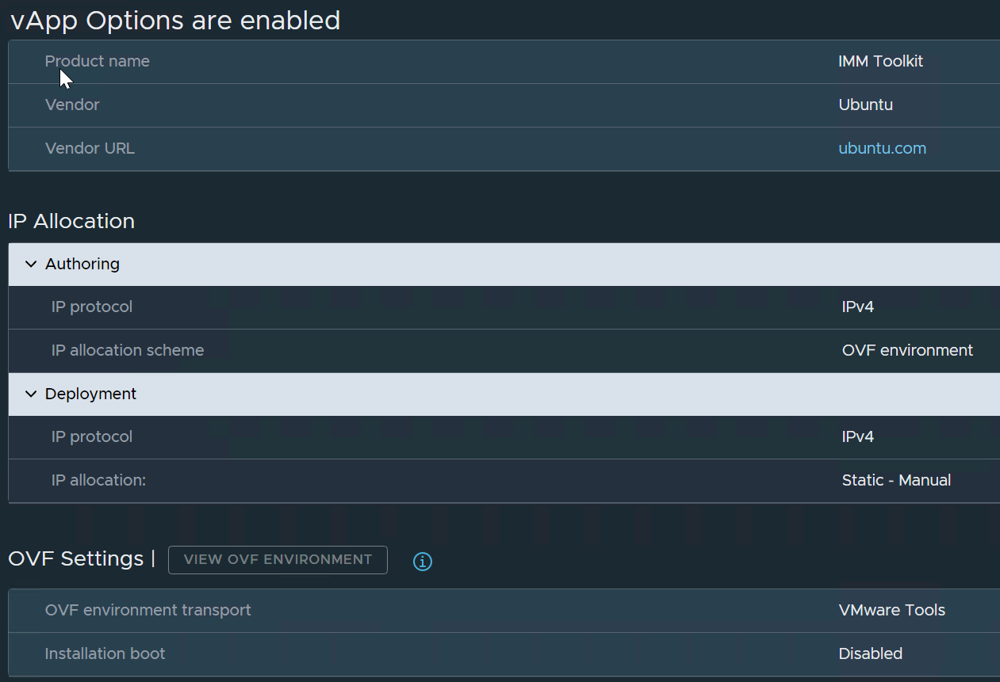

# IMM Toolkit Setup Instructions

## Updates/News

05-04-2023
* Initial Release

## Setup NGINX

Install NGINX and NetTools

```bash
sudo apt install net-tools
sudo apt install nginx
```
Configure Security Settings for nginx.

```bash
vim /etc/nginx/nginx/nginx.conf
```

* Copy the contents of the nginx.conf file

Generate the Certificate and Private Key

```bash
cd /etc/nginx
mkdir ssl
cd ssl
openssl req -new -newkey rsa:2048 -days 1095 -nodes -x509 -keyout nginx.key -out nginx.crt
chown www-data:www-data nginx.key
chown www-data:www-data nginx.crt
chmod 400 nginx.crt
chmod 400 nginx.key
```

Setup default site for File Services over HTTPS

```bash
cd /var/www/
mkdir upload
cd upload/
touch test.txt
cd /etc/nginx/sites-enabled
vim default
```

* Copy the contents of nginx-sites-default into the above file

```bash
systemctl restart nginx
systemctl status nginx.service
netstat -tulpn
```

## Setup NTP

* Install NTP

```bash
sudo apt install ntp
```

## Setup  OVF Customization Script

```bash
vim /usr/local/bin/ovf_network_config.sh
vim /etc/systemd/system/ovf-network-config.service
```

* Copy the contents of ovf_network_config.sh
* Copy the contents of ovf-network-config.service
* Change the Permissions on the Files

```bash
chmod 744 /usr/local/bin/ovf_network_config.sh
chmod 664 /etc/systemd/system/ovf-network-config.service
systemctl daemon-reload
systemctl enable ovf-network-config.service
```

## Install Python and Modules

```bash
sudo apt install python3-pip
cd ~
mkdir Downloads
mkdir github
cd github/
git clone https://github.com/scotttyso/intersight_iac
sudo ln -s /home/imm-toolkit/github/intersight_iac/ezci.py /usr/bin/ezimm.py
sudo ln -s /home/imm-toolkit/github/intersight_iac/ezci.py /usr/bin/ezci.py
cd intersight_iac/
sudo pip install -r requirements.txt
sudo pip install intersight
cd ~
```

## Install Ansible and Galaxy Modules

```bash
sudo apt install ansible -y
ansible-galaxy collection install cisco.intersight
```

## Install PowerShell and Modules

```bash
sudo snap install powershell
pwsh -Command Install-Module -Name Intersight.PowerShell -Force
pwsh -Command Install-Module -Name VMware.PowerCLI -Force
```


## Install Terraform

```bash
sudo apt-get update && sudo apt-get install -y gnupg software-properties-common
wget -O- https://apt.releases.hashicorp.com/gpg | gpg --dearmor | \
sudo tee /usr/share/keyrings/hashicorp-archive-keyring.gpg
echo "deb [signed-by=/usr/share/keyrings/hashicorp-archive-keyring.gpg] \
https://apt.releases.hashicorp.com $(lsb_release -cs) main" | \
sudo tee /etc/apt/sources.list.d/hashicorp.list
sudo apt update
sudo apt-get install terraform
terraform -install-autocomplete
```

## Install isdk

```bash
LOCATION=$(curl -s https://api.github.com/repos/cgascoig/isctl/releases/latest \
| grep "tag_name" \
| awk '{print "https://github.com/cgascoig/isctl/releases/download/" substr($2, 2, length($2)-3) \
"/isctl_" substr($2, 2, length($2)-3) "_Linux_x86_64.tar.gz"}' \
| sed 's/isctl_v/isctl_/'); curl -L -o isctl.tar.gz $LOCATION
tar -xvf isctl.tar.gz
rm isctl.tar.gz
sudo mv isctl /usr/local/bin/
sudo chmod +x /usr/local/bin/isctl
```

## Setup OVF Customization on VM




- IP Source
  - Category: Networking
  - Description:
  - Key ID: guestinfo.ip_source
  - Label: IP Source
  - Type: string choice
  - Choice List: "DHCP", "STATIC"
  - Default value: STATIC
- Hostname
  - Category: Networking
  - Description: The Fully Qualified Domain Name
  - Key ID: guestinfo.hostname
  - Label: Hostname
  - Type: string
- IP Address
  - Category: Networking
  - Description:
  - Key ID: guestinfo.ipaddress
  - Label: IP Address
  - Type: string
  - Length: 7 to 15
- Network Prefix
  - Category: Networking
  - Description:
  - Key ID: guestinfo.prefix
  - Label: Network Prefix
  - Type: integer
  - range: 1 to 30
  - Default value: 24
- Gateway
  - Category: Networking
  - Description:
  - Key ID: guestinfo.gateway
  - Label: Gateway
  - Type: string
  - Length: 7 to 15
- DNS Servers
  - Category: Networking
  - Description: Use a comma to separate multiple servers.  i.e. 8.8.4.4,8.8.8.8
  - Key ID: guestinfo.dns
  - Label: DNS Servers
  - Type: string
- DNS Domains
  - Category: Networking
  - Description: Use a comma to separate multiple domains.  i.e. cisco.com,example.com
  - Key ID: guestinfo.domain
  - Label: DNS Domains
  - Type: string
- NTP Servers
  - Category: Networking
  - Description: Use a comma to separate multiple servers.  i.e. 0.pool.ntp.org,1.pool.ntp.org
  - Key ID: guestinfo.ntp
  - Label: NTP Servers
  - Type: string

## Create OVA From VM or VM Template

```powershell
cd %ProgramFiles%\VMware\VMware OVF Tool
ovftool.exe vi://<vcenter-url>/<datacenter>/vm/<vm-folder> %HOMEPATH%\Downloads\imm-toolkitv0.1.ova
```